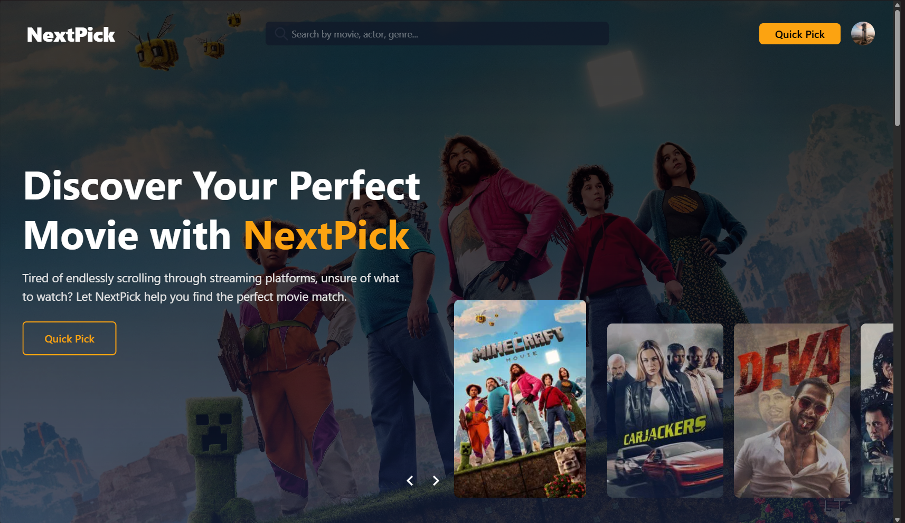

# 🎬 NextPick - Your Personal Movie Genie!


Tired of endlessly scrolling through streaming platforms, unsure of what to watch?  
**NextPick** helps you discover the perfect movie based on your preferences, quiz responses, and real-time suggestions — no more decision fatigue.

---

## 🚀 Features

- 🔍 **Smart Search** — Find movies by title, actor, or genre instantly
- 🎯 **Quick Pick Mode** — Get a random movie suggestion in one click
- 🧠 **Personalized Quizzes** — Built-in quiz to tailor suggestions to your taste
- 📚 **Dynamic Movie Database** — Constantly growing & evolving
- 👥 **User Authentication** — Secure login powered by Supabase
- 📱 **Fully Responsive** — Works beautifully across all screen sizes

---

## 🛠️ Tech Stack

| Frontend       | Backend       | Auth & DB      |
| -------------- | ------------- | -------------- |
| React.js       | Node.js       | Supabase       |
| Tailwind CSS   | Express (optional) | Supabase Auth |
| React Router   |               | PostgreSQL     |

---

## 📷 Screenshots

>   
> _"Discover Your Perfect Movie Match with NextPick"_

---

## 🧪 Running Locally

```bash
# 1. Clone the repository
git clone https://github.com/siddharthtashildar/NextPick.git
cd nextpick

# 2. Install dependencies
npm install

# 3. Add your Supabase credentials to a `.env` file
VITE_SUPABASE_URL=your_supabase_
